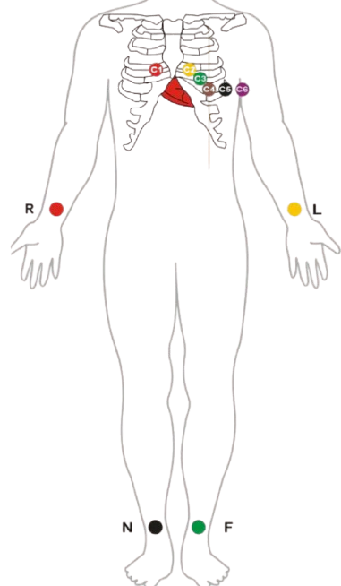

<h4>Introduction</h4>
The electrocardiogram (ECG) is the recording of the heart’s electrical activity, obtained by measuring the biopotentials generated during depolarization and repolarization of the cardiac muscles. It is measured using surface electrodes placed at specific points on the body.  
The interior of the cell membrane is considered to be negative with respect to the outside during resting conditions. When an electric impulse is generated in the heart, the interior part becomes positive with respect to the exterior. This change of polarity is called depolarization. After depolarization, the cell comes back to its original state, a process called repolarization. The ECG records the electrical signal of the heart as the muscle depolarizes (contracts) and repolarizes. The ECG signal typically has an amplitude ranging from 0.1 to 4 mV and contains frequency components from DC up to about 100 Hz. 

<h4>Cardiac Electrical Activity and ECG Waves</h4>
The Sinoatrial (SA) node is the basic, natural cardiac pacemaker that triggers its own train of action potentials. The action potential of the SA node propagates through the rest of the heart, causing a particular pattern of excitation and contraction. The sequence of events and waves in the cardiac cycle is as follows: 

 

<b>Figure-1: Standard ECG waveform showing P, QRS, and T waves.</b>
 

- The SA node fires.
- Electrical activity is propagated through the atrial musculature at comparatively low rates, causing slow –moving depolarization (contraction) of the atria. This results in the P wave in the ECG. Due to the slow contraction of the atria and their small size, the P wave is a slow, low amplitude wave, with an amplitude of about 0.1-0.2 mV and a duration of about 60-80 ms.
- The excitation wave faces a propagation delay at the atrio- ventricular (AV) node, which results in a normally iso-electric segment of about 60-80 ms after the P wave in ECG, known as the PQ segment. The pause assists in the completion of the transfer of blood from the atria to the ventricles.
- The bundle, the bundle branch and the purkinje system of specialized conduction fibers propagate the stimulus to the ventricles at a high rate.
- The wave of stimulus spread from the apex of the heart upwards, causing rapid depolarization (contraction) of the ventricles. This results in the QRS wave of the ECG- a sharp triphasic wave of about 1mV amplitude and 80 ms duration
- Ventricles muscle cells possess a relatively long action potential duration of about 300-350 ms. The plateau of the action potential causes a normally iso-electric segment of about 100- 120 ms after the QRS, known as the ST segment.
- Repolarization (relaxation) of the ventricles causes the slow T wave, with an amplitude of 0.1-0.3 mV and duration of 120-160 ms.

<h4>Components of ECG Acquisition System</h4>
The ECG acquisition system is a specialized biomedical setup designed to detect, amplify, filter, and display the heart’s electrical activity in the form of an electrocardiogram. It consists of several key components that work together to ensure accurate and noise-free signal measurement. 

 
<h4>1. Signal Source: The Human Body</h4>
The human body serves as a complex bioelectric generator, producing various types of signals through different physiological processes. One such signal is the ECG. 

<h4>2. Electrodes (Transducers)</h4>
Electrodes act as primary sensors that detect the tiny biopotentials generated by the heart. For a 12-lead ECG, ten electrodes are used — four limb electrodes (RA, LA, RL, LL) and six chest electrodes (V1, V2, V3, V4, V5, and V6). 

<h4>3. Instrumentation Amplifier</h4>
Since ECG signals are very small (0.1–4 mV), a high-gain, high-CMRR instrumentation amplifier is used to amplify the differential signal while rejecting common-mode noise and interference.br>

<h4>4. Filters</h4>
Filters are used to remove unwanted frequency components.which is High-pass filter ,Low-pass filter ,Notch filter (50/60 Hz) and more. 

<h4>5. Analog-to-Digital Converter (ADC)</h4>
The conditioned analog ECG signal is converted into digital form using an ADC. A typical sampling rate of 250–1000 samples/sec is used to preserve signal fidelity during digital processing and display. 

<h4>6. Display and Recording Unit</h4>
The processed ECG signal is displayed on a monitor or oscilloscope and may also be stored digitally for further analysis. Modern systems may use software interfaces for real-time plotting and waveform analysis. 

<h4>ECG Electrode Placement & 12-Lead ECG</h4>
In an ECG, a lead represents the voltage difference between two electrodes placed on the body. In a 12-lead ECG, a total of 10 surface electrodes are used, consisting of 4 limb electrodes—Right Arm (RA), Left Arm (LA), Right Leg (RL), and Left Leg (LL)—and 6 chest electrodes—V1, V2, V3, V4, V5, and V6. These electrodes are positioned on specific anatomical locations on the arms, legs, and chest to record ecg. A conductive gel is applied to ensure good contact and reduce skin–electrode impedance, enabling accurate acquisition of the heart’s electrical signals. 

<h4>Table:Electrode Placement</h4>

| Electrodes | Electrodes Position |
| --- | --- |
| RA | On the right arm, avoiding thick muscle. |
| LA |In the same location where RA was placed, but on the left arm. |
| RL | On the right leg, lateral calf muscle. |
| LL | In the same location where RL was placed, but on the left leg. |
| V1 | In the fourth intercostal space (between ribs 4 and 5) just to the right of the sternum (breastbone). |
| V2 | In the fourth intercostal space (between ribs 4 and 5) just to the left of the sternum. |
| V3 | Between leads V2 and V4. |
| V4 | In the fifth intercostal space (between ribs 5 and 6) in the mid-clavicular line. |
| V5 | Horizontally even with V4, in the left anterior axillary line. |
| V6 | Horizontally even with V4 and V5 in the midaxillary line. |

 

<b>Figure-2: Electrode Placement.</b>
 

A total of 12 Leads are derived from these 10 electrodes. These 12 leads are classified as 3 limb leads, 3 augmented limb leads and 6 precordial leads. Out of this 12 leads, limb leads are bipolar while all other leads are unipolar leads. The definition for all 12 leads is as follows:- 
 - Lead I – is the signal between negative RA and positive LA electrodes.
 - Lead II – is the signal between negative RA and positive LL electrodes.
 - Lead III – is the signal between negative LA and positive LL electrodes.

 

 

<b>Figure-3: Einthoven’s Triangle showing limb leads I, II, III</b>
 

These three limb leads form the points of what is known as Einthoven's triangle as shown in figure 3, which is the theoretical triangle drawn around the heart with heart at center. According to <b>Einthoven’s Law:</b>
<b>Lead I - Lead II + Lead III = 0</b>

- Lead aVR or Augmented vector right – is the signal between the positive electrode on the right arm and the negative electrode which is a combination of the left arm electrode and the left leg electrode.
- Lead aVL or augmented vector left – is the signal between the positive electrode on the left arm and the negative electrode which is a combination of the right arm electrode and the left leg electrode.
- Lead aVF or Augmented vector foot – is the signal between the positive electrode on the left leg and the negative electrode which is a combination of the right arm electrode and the left arm electrode.
- Precordial leads V1-V6 – is the signal between the corresponding positive V1-V6 electrode on the chest and the negative electrode formed by the Wilson terminal obtained by adding three limb leads.
- (Note: Wilson terminal is formed by the average of the 3 limb leads and approximate ground. This is possible because of Einthoven's Law which states that I + (-II) + III = 0.)
